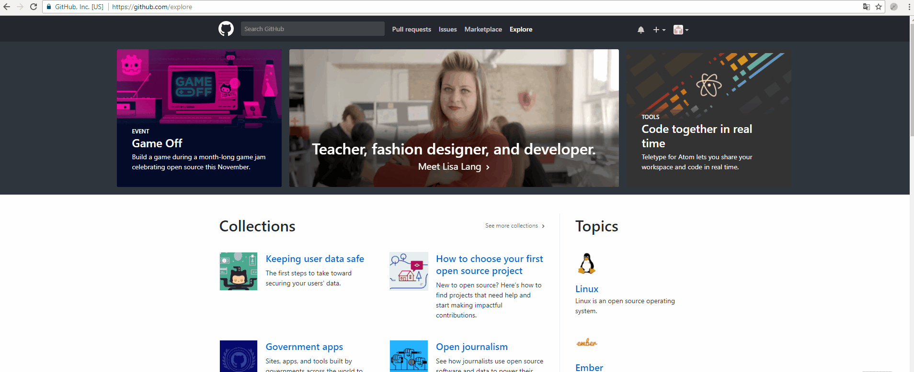

# DropDownApp

DropDownApp is a skull for a WPF C# application which can be showed and hidden like the guake terminal,

Just press **F10** from anywhere to pop the application from the top

## Quick Installation

You can find the template of the project on the market place [right here](https://marketplace.visualstudio.com/items?itemName=quentinschroter.dropdown) !

Download and install it and you will find the project template under Visual C#.

## Settings

All the settings are alterable in AppSettings.settings
